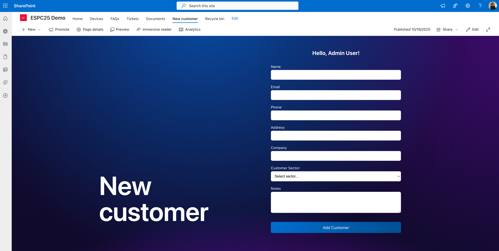
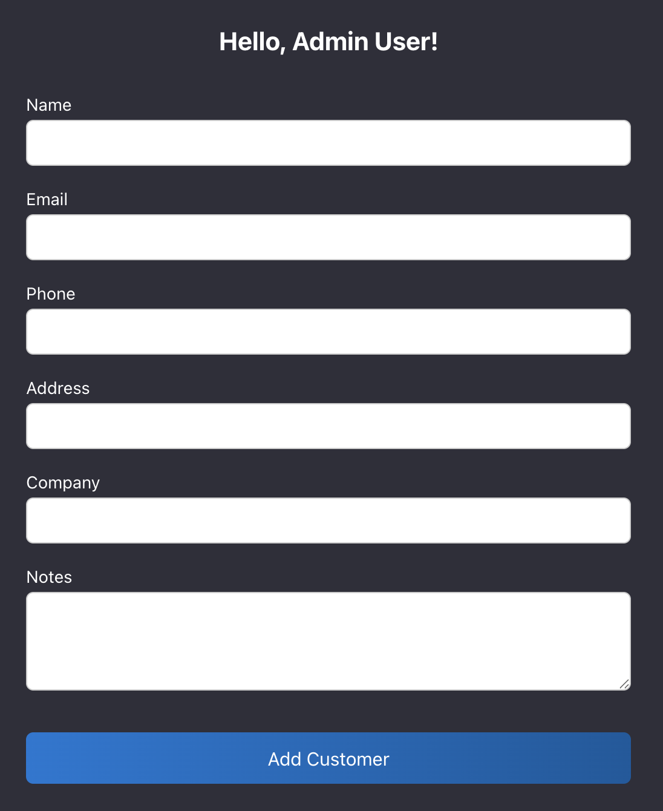
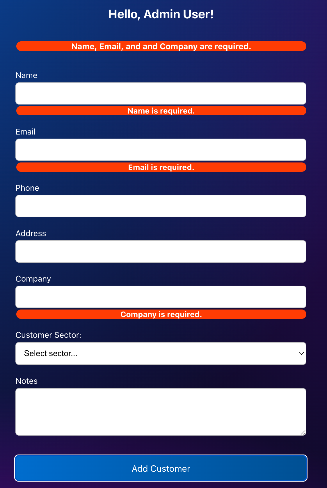

# espc-spfx-session-demo

[](https://github.com/GuidoZam/espc-spfx-session-demo/actions/workflows/deploy-spfx-solution_PROD.yml)

[](https://github.com/GuidoZam/espc-spfx-session-demo/actions/workflows/deploy-spfx-solution_TEST.yml)

[](https://github.com/GuidoZam/espc-spfx-session-demo/actions/workflows/execute-unit-tests.yml)


## Solution Overview

This project demonstrates a SharePoint Framework (SPFx) web part solution integrated with modern CI/CD and automated testing practices. It features:

- **NewCustomerForm Web Part**: A comprehensive SPFx web part showcasing React integration, conditional UI logic, localization, and asset management. Includes CustomerSector dropdown with conditional NDA checkbox functionality.
- **Automated Testing**: End-to-end tests using Playwright with visual regression testing, including authentication flows for Microsoft 365 and SharePoint Online.
- **Visual Testing**: Comprehensive snapshot testing to verify UI behavior across different browsers and scenarios.
- **CI/CD Integration**: GitHub Actions workflows for building, testing, and deploying the solution.
- **Azure Storage Deployment**: Example configuration for deploying assets to Azure Storage.

### Solution screenshots







### Key Technologies
- SharePoint Framework (SPFx)
- React
- TypeScript
- Jest (unit testing)
- Playwright (E2E testing)
- GitHub Actions (CI/CD)

## CI/CD Configuration

This project uses GitHub Actions for Continuous Integration and Continuous Deployment:

- **Execute Tests** (`execute tests.yml`): Runs unit tests using Jest when code is pushed to the `dev` branch
- **Deploy SPFx Solution TEST** (`deploy-spfx-solution_TEST.yml`): Automatically builds, tests, and deploys the SPFx solution to SharePoint when code is pushed to the `test` branch
- **Deploy SPFx Solution PROD** (`deploy-spfx-solution_PROD.yml`): Automatically builds, tests, and deploys the SPFx solution to SharePoint when code is pushed to the `main` branch

### Required Secrets and Variables

For the deployment workflow to work, the following GitHub secrets and variables must be configured:

**Secrets:**
- `M365_CERTIFICATE`: Base64-encoded certificate for Microsoft 365 authentication
- `M365_CERTIFICATE_PASSWORD`: Password for the certificate (if required)

**Variables:**
- `M365_CLIENT_ID`: App ID of the Entra application used for authentication  
- `M365_TENANT`: ID of the Microsoft 365 tenant
- `TEST_SHAREPOINT_SITE_URL`: URL of the target SharePoint site for deployment and testing
- `TEST_USERNAME`, `TEST_PASSWORD`: Credentials for Playwright authentication (test environment)

### Troubleshooting

If you encounter deployment issues, see the [CI/CD Troubleshooting Guide](docs/CI-CD-TROUBLESHOOTING.md) for common problems and solutions.

### Configuration

For tenant-specific environment settings (TEST/PROD), see the [Tenant Settings Implementation Guide](docs/TENANT-SETTINGS-IMPLEMENTATION.md) for setup instructions and PowerShell scripts.

## Summary

This solution provides a reference implementation for:
- Building SPFx web parts with React and TypeScript
- Automating deployment and testing using GitHub Actions
- Implementing unit tests with Jest
- Integrating Playwright for robust E2E testing of SharePoint authentication and UI flows
- Managing assets and configuration for enterprise scenarios

## Used SharePoint Framework Version


## Applies to

- [SharePoint Framework](https://aka.ms/spfx)
- [Microsoft 365 tenant](https://docs.microsoft.com/en-us/sharepoint/dev/spfx/set-up-your-developer-tenant)

> Get your own free development tenant by subscribing to [Microsoft 365 developer program](http://aka.ms/o365devprogram)

## Prerequisites

- Node.js LTS
- SPFx development environment
- Microsoft 365 developer tenant

## Solution

| Solution    | Author(s)                                               |
| ----------- | ------------------------------------------------------- |
| espc-spfx-session-demo | Guido Zambarda ([@GuidoZam](https://x.com/iamguidozam)) & Peter Paul Kirschner ([@petkir_at](https://x.com/petkir_at)) |

## Version history

| Version | Date             | Comments        |
| ------- | ---------------- | --------------- |
| 1.0     | July 20, 2025 | Initial release |

## Disclaimer

**THIS CODE IS PROVIDED _AS IS_ WITHOUT WARRANTY OF ANY KIND, EITHER EXPRESS OR IMPLIED, INCLUDING ANY IMPLIED WARRANTIES OF FITNESS FOR A PARTICULAR PURPOSE, MERCHANTABILITY, OR NON-INFRINGEMENT.**

---

## Minimal Path to Awesome

- Clone this repository
- Ensure that you are at the solution folder
- in the command-line run:
  - **npm install**
  - **gulp serve**

## Features

This extension illustrates the following concepts:

- SPFx web part development with React
- **Conditional UI Logic**: CustomerSector dropdown with conditional NDA checkbox
- **Form State Management**: Advanced form handling with business logic
- **Tenant Settings Integration**: Environment configuration using SharePoint tenant properties
- **Service Injection**: Service-based architecture for accessing tenant settings
- Localization and asset management
- Unit testing with Jest
- **Visual Regression Testing**: Automated E2E testing with Playwright snapshots
- CI/CD with GitHub Actions

### Customer Form Features

The NewCustomerForm web part demonstrates:

- **CustomerSector Dropdown**: Three options (Non profit, Private, Government)
- **Conditional NDA Checkbox**: Only visible for Government sector customers
- **Smart Reset Logic**: NDA checkbox resets when sector changes
- **Business Rules**: NDA value only applies to Government customers
- **Form Validation**: Required field validation with user feedback
- **Success Notifications**: Visual feedback on successful form submission
- **Environment Badge**: Displays current environment badge (hidden in PROD for clean UI)
- **Service-Based Configuration**: Uses TenantSettingsService to load environment configuration

## Testing

This project includes comprehensive testing coverage:

### Unit Tests (Jest)
```bash
npm test
```

- Component rendering tests
- Form validation logic
- Conditional field visibility
- Business rule enforcement (NDA logic)
- User interaction scenarios

### End-to-End Tests (Playwright)
```bash
npm run test:e2e
```

- Cross-browser testing (Chromium, Firefox, WebKit)
- SharePoint authentication flows
- Complete user workflows
- **Visual regression testing with snapshots**

### Visual Testing & Snapshots

The project includes comprehensive visual regression testing:

```bash
# Generate/update snapshots
npm run test:e2e -- --update-snapshots

# View snapshot analysis
./scripts/view-snapshots.sh
```

**Snapshot Categories:**
- **Main Workflow**: Form filling and submission process
- **NDA Visibility**: Conditional checkbox behavior across sectors
- **Government Workflow**: End-to-end government customer scenarios

📖 **See [SNAPSHOTS_DOCUMENTATION.md](./docs/SNAPSHOTS_DOCUMENTATION.md) for detailed visual testing documentation**

## 📸 Visual Testing Overview

<!-- BEGIN VISUAL_TESTING_OVERVIEW -->
[View complete visual testing overview](./docs/VISUAL_TESTING_OVERVIEW.md)


### Quick Snapshot Summary

The visual regression tests capture **34+ snapshots** across 3 browsers documenting:

| Category | Purpose | Key Changes |
|----------|---------|-------------|
| **🔄 Main Workflow** (01-06) | Complete form submission flow | CustomerSector dropdown integration, form reset behavior |
| **✅ NDA Visibility** (nda-) | Conditional checkbox logic | NDA checkbox shows/hides based on sector selection |
| **🏛️ Government Flow** (gov-) | End-to-end government customer | Real-world scenario with NDA requirement |

### Browser Coverage
- 🌐 **Chromium**: Modern web standards (      34 snapshots)
- 🦊 **Firefox**: Gecko rendering engine (       0 snapshots)
- 🧭 **WebKit**: Safari/mobile compatibility (       0 snapshots)

### Generate Snapshot Report
```bash
# Create markdown report of current snapshots
./scripts/view-snapshots.sh

# View generated report
cat ./docs/SNAPSHOT_REPORT.md
```

📊 **Latest Stats**:       12 main workflow,       12 NDA visibility,       10 government workflow snapshots

<!-- END VISUAL_TESTING_OVERVIEW -->

## References

- [Getting started with SharePoint Framework](https://docs.microsoft.com/en-us/sharepoint/dev/spfx/set-up-your-developer-tenant)
- [Use PnPjs to access Graph APIs](https://pnp.github.io/pnpjs/)
- [Microsoft 365 Patterns and Practices](https://aka.ms/m365pnp) - Guidance, tooling, samples and open-source controls for your Microsoft 365 development
- [DevProxy setup](https://learn.microsoft.com/en-us/microsoft-cloud/dev/dev-proxy/get-started/set-up)
- [DevProxy configuration](https://github.com/pnp/proxy-samples/tree/9a4287685c1f856230431864f2802f5712184083/samples/spfx) - Proxy configuration for SPFx development

## Project Structure & Implementation Details

The repository is organized as follows:

- `src/` – Source code for the SPFx web part, including:
  - `webparts/newCustomerForm/NewCustomerFormWebPart.ts` – Main web part implementation (TypeScript, React)
  - `webparts/newCustomerForm/components/NewCustomerForm.tsx` – Main React component for the web part UI
  - `webparts/newCustomerForm/components/NewCustomerForm.module.scss` – Styles for the web part
  - `webparts/newCustomerForm/components/NewCustomerForm.test.tsx` – Unit tests for the React component (Jest)
  - `webparts/newCustomerForm/components/INewCustomerFormProps.ts` – Props interface for the React component
  - `webparts/newCustomerForm/assets/` – Images and static assets
  - `webparts/newCustomerForm/loc/` – Localization files
- `lib/` – Transpiled output from TypeScript build
- `config/` – Configuration files for SPFx, deployment, and manifests
- `cert/` – Certificates for local development and deployment
- `tests/` – Playwright E2E tests and Jest unit test setup
- `gulpfile.js` – Gulp tasks for building, serving, and packaging the solution
- `package.json` – Project dependencies and scripts
- `jest.setup.ts` – Jest configuration for unit tests
- `playwright.config.ts` – Playwright configuration for E2E tests
- `sharepoint/solution/` – Packaged SharePoint solution files (`.sppkg`)

### Main Implementation Files
- **NewCustomerFormWebPart.ts**: Implements the SPFx web part, rendering the React component and handling properties.
- **NewCustomerForm.tsx**: Main React component for the web part UI.
- **NewCustomerForm.module.scss**: Styles for the web part.
- **NewCustomerForm.test.tsx**: Unit tests for the React component (Jest).
- **INewCustomerFormProps.ts**: Props interface for the React component.
- **basic.spec.ts**: Playwright E2E test for authentication and UI flows.

### Running Locally & Testing

- To run the web part locally:
  ```sh
  npm install
  gulp serve
  ```
- To run unit tests:
  ```sh
  npm test
  ```
- To run Playwright E2E tests:
  ```sh
  npm run test:e2e
  ```

### Deployment

- Build and package the solution:
  ```sh
  gulp bundle --ship
  gulp package-solution --ship
  ```
- Deploy the `.sppkg` file from `sharepoint/solution/` to your SharePoint App Catalog.
